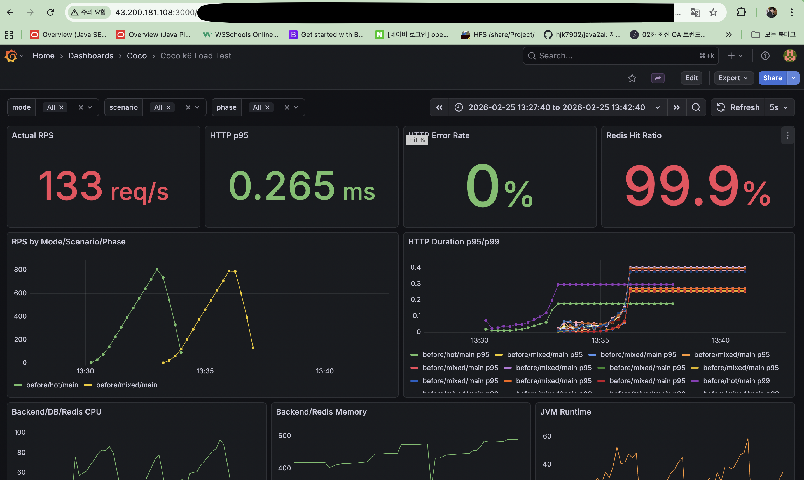
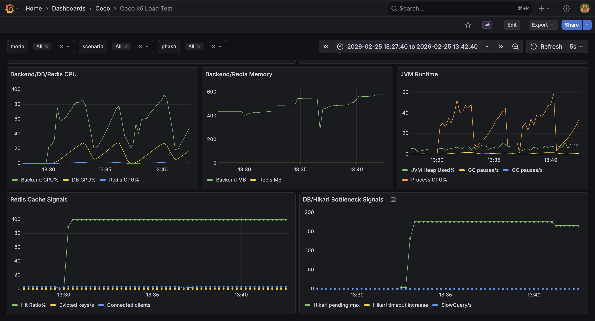

# COCO : 리셀 스니커즈 중개 거래 플랫폼

> 리셀 스니커즈 거래를 위해 상품 탐색, 입찰 매칭, 주문/결제, 마이페이지까지 연결한 중개 거래 서비스입니다.

## 프로젝트 개요
- 백엔드(Spring Boot)와 프론트엔드(React)를 분리한 웹 서비스 구조
- MariaDB/Redis 기반 데이터 처리와 캐시 적용
- AWS EC2 2대(Loadgen, SUT) 분리 환경에서 모니터링 스택을 구성해 애플리케이션/DB/컨테이너 상태와 부하-병목 상관관계를 추적
- GitHub Actions 기반 자동 배포 파이프라인 운영

## 기술 스택

| 분류 | 사용 기술 |
|---|---|
| Backend | Java 21, Spring Boot 3.5.3, Spring Security, OAuth2 Client, JPA, WebFlux |
| Frontend | React 19.1.0, Axios |
| Database | MariaDB 10.6, Redis 7 |
| Monitoring | Spring Actuator, Prometheus, Grafana, Loki, Promtail, cAdvisor |
| Infra | AWS EC2 (2 Instances), Docker, GitHub Actions (CI/CD), Nginx |
| External | Toss Payments API, Daum Map API |

## 주요 기능

### 사용자 플로우
1. 회원가입/로그인 후 JWT 기반으로 인증 세션을 유지합니다.
2. 상품 검색/상세에서 사이즈별 호가(최저 판매가/최고 구매가)를 확인합니다.
3. 구매/판매 입찰 등록 시 반대 포지션과 가격 조건이 맞으면 즉시 매칭됩니다.
4. 매칭 시 주문이 생성되고 결제 준비/승인 단계를 거쳐 상태가 갱신됩니다.
5. 마이페이지에서 주문/입찰/위시리스트/등록 상품을 조회하고 관리합니다.

### 핵심 API
| 기능 | 설명 | 대표 엔드포인트 |
|---|---|---|
| 인증 | 로그인, 로그아웃, 회원가입 | `POST /api/auth/login`, `POST /api/auth/logout`, `POST /api/auth/signup` |
| 상품 | 상품 등록, 검색, 상세 조회 | `POST /api/products`, `GET /api/products/search`, `GET /api/products/{productId}` |
| 입찰 | 구매/판매 입찰 등록, 취소, 호가 요약 조회 | `POST /api/biddings`, `PUT /api/biddings/{biddingId}/cancel`, `GET /api/biddings/summary` |
| 주문/결제 | 주문 조회, 결제 준비, 결제 승인 | `GET /api/orders/{id}`, `POST /api/payments/prepare`, `POST /api/payments/confirm` |
| 마이페이지 | 회원 정보/주문/입찰/위시리스트/등록 상품 조회 | `GET /api/mypage/info`, `GET /api/mypage/orders`, `GET /api/mypage/biddings/buys`, `GET /api/mypage/biddings/sales`, `GET /api/mypage/wishlist`, `GET /api/mypage/products` |
| 위시리스트 | 추가/조회/삭제 | `POST /api/wishlist`, `GET /api/wishlist`, `DELETE /api/wishlist/{wishlistId}` |

## 아키텍처 요약
- Frontend: React SPA가 Nginx를 통해 서비스됩니다.
- Backend: Spring Boot API 서버가 인증/상품/입찰/주문/결제 도메인을 처리합니다.
- Database: MariaDB에 거래 데이터가 저장되고 Redis는 캐시/토큰 블랙리스트에 사용됩니다.
- Monitoring: Prometheus가 메트릭을 수집하고 Grafana/Loki에서 시각화 및 로그 추적을 수행합니다.

## 실행 방법

### 1) 환경 변수 준비
- 루트 `.env` 파일에 DB/JWT/Toss 관련 값을 설정합니다.

### 2) 서비스 실행
```bash
docker compose up -d
```

### 3) 접속 확인
- Frontend: `http://localhost`
- Backend: `http://localhost:8080`
- Grafana: `http://localhost:3000`
- Prometheus: `http://localhost:9090`

## DB 모니터링 가이드
- 상세 운영 가이드: `monitoring/README.md`
- 성능 스토리라인 자동화: `monitoring/perf-storyline/README.md`
- 제공 범위: DB 지표 수집, slow query 파이프라인, 알림 룰, SQL 리포트 자동화
- 검증 환경: AWS EC2 2대 구성 (Loadgen: k6 부하 생성, SUT: API/DB/Redis/Monitoring 스택 운영)
- Loadgen에서 시나리오 트래픽을 발생시키고, SUT에서 p95/p99, SlowQuery, Hikari pending, CPU/Memory 지표를 동시 관측합니다.




## 배포 파이프라인
- 워크플로우: `.github/workflows/cd.yml`
- `main` 브랜치 푸시 시 백엔드/프론트엔드 이미지를 빌드합니다.
- GitHub Actions가 EC2로 SSH 접속해 배포 명령을 수행합니다.

## 개발자 참고 사항
07-14 user/coco 내의 폴더 사용할 것. 이 repo 사용할 것
